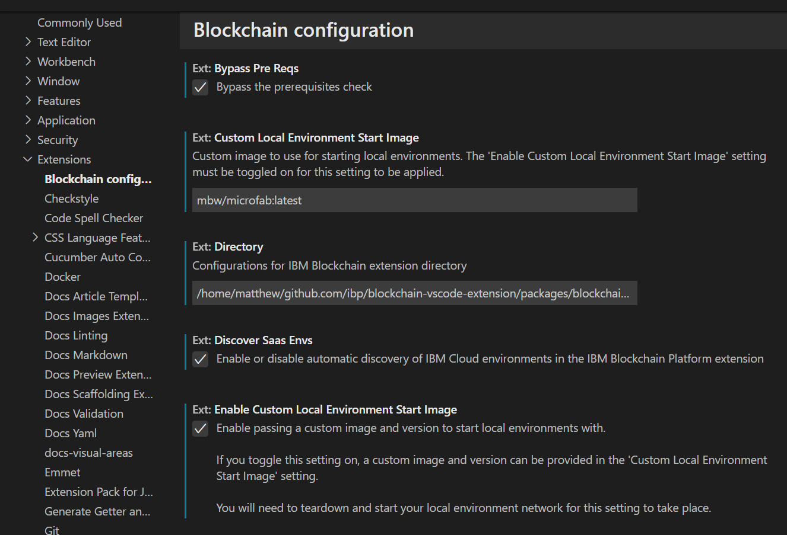
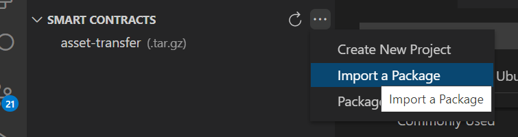

# ibp-fabric-toolchain-demo-scenario
Demo Scenario (including contracts) for the IBP-Fabric Toolchain


## Contracts

_asset-transfer-ts_  basic asset transfer example with Typescript

## Using the test-network


```bash
cd fabric-samples/test-network.sh
./network.sh down
./network.sh up createChannel -ca -s couchdb
```
### Set for the Peer CLI Commands
The `setOrgEnv.sh` script can be used to setup the environment variables for the ogrganziations, this will will help to be able to use the `peer` commands directly.

First, ensure that the peer binaries are on your path, and the Fabric Config path is set Assuming that you're in the `test-network` directory.

```bash
 export PATH=$PATH:$(realpath ../bin)
 export FABRIC_CFG_PATH=$(realpath ../config)
```

You can then set up the environment variables for each organization. The `./setOrgEnv.sh` command is designed to be run as follows.

```bash
export $(./setOrgEnv.sh Org2 | xargs)
```
(Note bash v4 is required for the scripts)


peer lifecycle chaincode install assettransfer.tar.gz
peer lifecycle chaincode approveformyorg -o localhost:7050 --ordererTLSHostnameOverride orderer.example.com --tls --cafile "$ORDERER_CA" --channelID mychannel --name assettransfer --version 1 --package-id ${CHAINCODE_ID} --sequence 1

peer lifecycle chaincode commit -o localhost:7050 --ordererTLSHostnameOverride orderer.example.com --tls --cafile "$ORDERER_CA" --channelID mychannel --name assettransfer --version 1 --sequence 1 --peerAddresses localhost:7051 --peerAddresses localhost:9051 --tlsRootCertFiles ${PEER0_ORG1_CA} --tlsRootCertFiles ${PEER0_ORG2_CA}


export CHAINCODE_SERVER_ADDRESS=0.0.0.0:9999


## Use the latest Microfab version

You need to use the latest microfab version; here I'm using a copy locally rebuilt and tagged with `mbw/microfab:latest`.

In a new VSCode window, open the settings and find the Blockchain Configuration. Enter the name of the "Custom Local Environment Start Image", and select the Enable Custom Local Environment Start Image"




## Running and deploying a contract

Add this repo to the workspace, and in a terminal window (either inside or outside VSCode to your preference) change to repo directory. 

First we need to `npm install` and `npm build` the chaincode

```bash
cd contracts/asset-transfer-ts
npm install
npm run build
```
This has built the typescript contract. Debug settings have already been included in the typescript configuration. If you get issues with later debugging, check the typescript configuration in `tsconfig.json`

### Create the Chaincode Package 

In common with the traditional ways of deploying chaincodes (containing SmartContracts) we need to have a chaincode package. In this case however this package primarily contains the host:port of where the chaincode is running. 

To create a package

```bash
 npm run package:cc

> asset-transfer-basic@1.0.0 package:cc
> ./ccaas_pkg.sh

-rw-r--r-- 1 matthew matthew 461 Jan 27 15:25 asset-transfer.tar.gz
CHAINCODE_ID=asset-transfer_1:5206e43f17e0532a67480d7a384dd402da15f23a713e75db5b5ef898627315a9
```

## Start the local Fabric Network

### Install the chaincode package

In VSCode, click on the Blockchain Icon to get into the Blockchain View. From the Smart Contracts panel, import the `asset-transfer-tar.gz`. In this example this has already been imported




Then from the FabricEnvironment panel, deploy the smart contract you just imported. 


In this demo scenario, we'll be running two docker containers. As these need to interact we need to create a dedicated docker network

```bash
docker network create audit_network
```

Startup the Fabric Infrastructure, we're using MicroFab here as it's a single container and fast to start. Plus it already has the configuration required within it to start external chaincodes.

```bash
export MICROFAB_CONFIG='{
    "endorsing_organizations":[
        {
            "name": "Ampretia"
        }
    ],
    "channels":[
        {
            "name": "auditnet",
            "endorsing_organizations":[
                "Ampretia"
            ]
        }
    ],
    "capability_level":"V2_0"
}'

docker run --name microfab --network audit_network --rm -ti -p 8080:8080 -e MICROFAB_CONFIG="${MICROFAB_CONFIG}"  ibmcom/ibp-microfab

```

'Proxy' Chaincode

```json
{
  "address": "javacc.example.com:9999",
  "dial_timeout": "10s",
  "tls_required": false
}
```


npm install -g @hyperledgendary/weftility
curl -s http://console.127-0-0-1.nip.io:8080/ak/api/v1/components | weft microfab -w ./_cfg/_wallets -p ./_cfg/_gateways -m ./_cfg/_msp -f


```bash
curl -s https://raw.githubusercontent.com/hyperledgendary/fabric-builders/master/tools/pkgcc.sh > ./pkgcc.sh && chmod u+x ./pkgcc.sh
./pkgcc.sh -l javacc -t external connection.json
```

docker build -t java-cc-server .  


CHAINCODE_SERVER_ADDRESS=javacc.example.com:9999
CHAINCODE_ID=javacc:30e755c332d780fb6d5c55e9c48e5865fe22df2e642ecc228ef37c0d523793f9


docker run -it --rm --name javacc.example.com --hostname javacc.example.com --env-file chaincode.env --network=audit_network java-cc-server

ks
